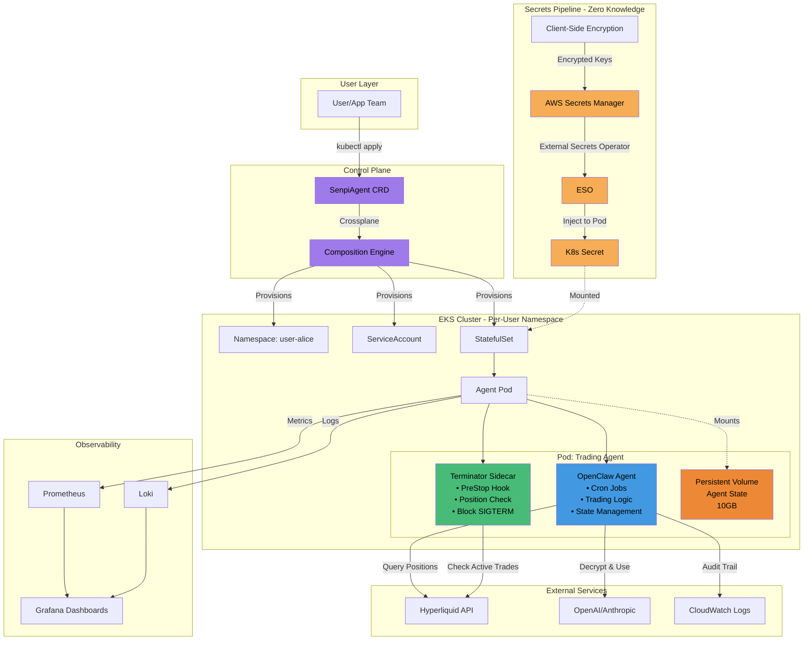
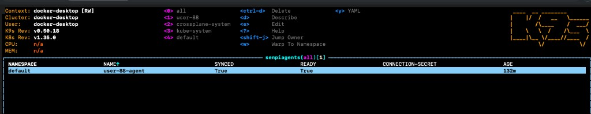
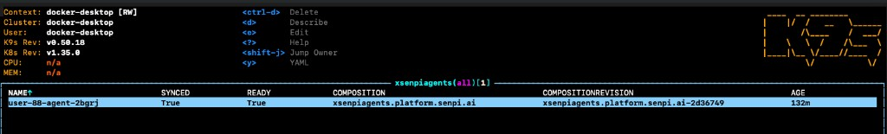
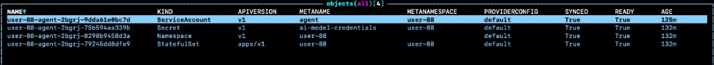
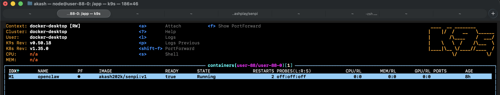
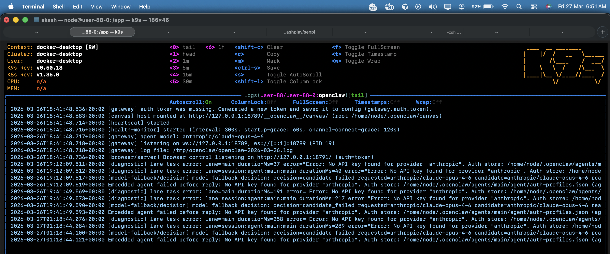

# Infrastructure for AI Trading Agents That Can't Afford Downtime

## The Problem I Identified

Senpi AI trading agents managing live positions face critical infrastructure failures on platforms like Railway:

1. **Pod evictions liquidate open positions** — Infrastructure events trigger SIGTERM during active trades, leaving capital unprotected
2. **Users must share AI API keys with the platform** — OpenAI/Anthropic keys stored in Railway environment variables = platform has full access. Regulatory red flag for fintech.
3. **SOC 2 requires Pro tier minimum** — Hobby ($5/month) has zero compliance coverage. [Pro ($20/month) has SOC 2](https://railway.com/pricing#:~:text=18%20months-,SOC%202%20compliance,-Granular%20access%20control), but doesn't solve the core problem: user secrets living on shared infrastructure without true isolation.
4. **No real multi-tenancy** — One agent's failure cascades; no namespace isolation or resource guarantees

When downtime means liquidations and compliance means custody of user credentials, infrastructure isn't optional—it's the product.

---

## Architecture Solution



### Key Architecture Components

### 1. Crossplane Composition Layer
One API call creates everything. You define a `SenpiAgent` resource, Crossplane handles the rest:

```yaml
apiVersion: platform.senpi.ai/v1alpha1
kind:
metadata:
  name: user-88-agent
  namespace: default
spec:
  parameters:
    userId: "user-88"
    walletAddress: "0xc97ff0A66bC84FB8BcCEa34065af48d86be72B45"
    modelProvider: "openai"
    modelApiKey: "Xktb3BlbmFpLWtleQo="
    modelApiKeySalt: "dGVzdHNhbHQxMjM0NTY3OA=="
    modelName: "gpt-4"
    strategy: "striker"
```

**What Crossplane provisions automatically:**
- Dedicated namespace (`user-88`) > All agents gets deployed into it 
- ServiceAccount with RBAC
- Encrypted secrets from AWS Secrets Manager
- StatefulSet with persistent volume (10GB)
- Terminator sidecar for capital protection

**Real reconciliation in action:** Change the spec, Crossplane updates infrastructure. Delete the resource, everything gets cleaned up. No manual kubectl commands, no leftover resources.

This POC shows 4 core resources. Production would add: NetworkPolicies, PodDisruptionBudgets, HorizontalPodAutoscaler, monitoring ServiceMonitors, backup CronJobs, and more—all from one CRD.

**Proof it works:**


*Single SenpiAgent resource triggers full stack provisioning*


*Crossplane composition provisions namespace, secrets, StatefulSet in sync*


*All child resources: namespace, ServiceAccount, secrets, StatefulSet running*


*Openclaw agent running*

*Openclaw agent logs - real openclaw deployed but need to configure and modify i mean dummy creds addded for now*

**Deployment complexity: gone. App teams never touch Kubernetes.**

### 2. Terminator Sidecar — Capital Protection
PreStop hook that blocks pod termination during active Hyperliquid positions. 5-minute timeout prevents node deadlock. Infrastructure updates don't kill trades.

```go
func checkActivePositions() bool {
    // Query Hyperliquid API or local state
    // Block SIGTERM if positions are open
}
```

### 3. Zero-Knowledge Secrets Pipeline
**The Railway Problem:** Users paste OpenAI API keys into environment variables. Platform has full access. SOC 2 compliance available on Pro ($20/month), but Hobby users have no coverage. Even with SOC 2, Railway still holds plaintext secrets.

**The Solution:** Client-side encryption → AWS Secrets Manager → External Secrets Operator → pod injection. Keys never touch platform servers in plaintext. Audit trail included. SOC 2 compliance built into architecture regardless of tier.

---

## What This Enables

| Capability | Railway Hobby | Railway Pro/Enterprise | This Architecture |
|------------|---------------|------------------------|-------------------|
| **Pod shutdown safety** | ❌ Positions exposed | ❌ Positions exposed | ✅ Protected |
| **User API keys** | ❌ Platform has access | ❌ Platform has access | ✅ Zero-knowledge |
| **SOC 2 compliance** | ❌ Not available | ✅ Available | ✅ Built-in |
| **Real multi-tenancy** | ❌ Process isolation | ❌ Process isolation | ✅ Namespace isolation |

---

## Technical Stack

**Infrastructure:** EKS, Crossplane, Karpenter, VPC/IAM  
**Secrets:** AWS Secrets Manager, External Secrets Operator  
**Deployments:** GitHub Actions, ArgoCD, Helm, zero-downtime rollouts  
**Observability:** Prometheus, Grafana, Loki — SLOs for financial systems  
**Agent Runtime:** StatefulSets, persistent volumes, OpenClaw integration  
**Blockchain:** Hyperliquid API integration, wallet operations, position monitoring  

---

## Implementation Roadmap

1. Production EKS cluster + Crossplane control plane
2. Secrets pipeline: AWS Secrets Manager → ESO → pod injection
3. Terminator sidecar integration across agent fleet
4. Observability stack: alerting on position orphaning, state corruption, MCP auth expiry
5. Scale testing: dozens → thousands of concurrent agents
6. SOC 2 compliance audit preparation

---

**This infrastructure becomes the competitive moat.** Competitors lose traders because their infrastructure liquidates positions. This one doesn't.
