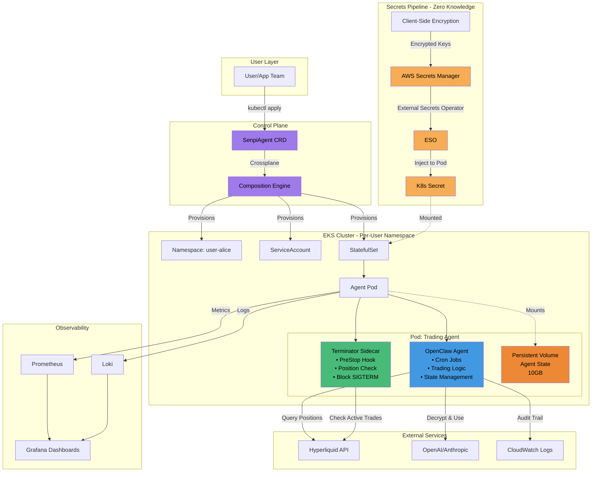
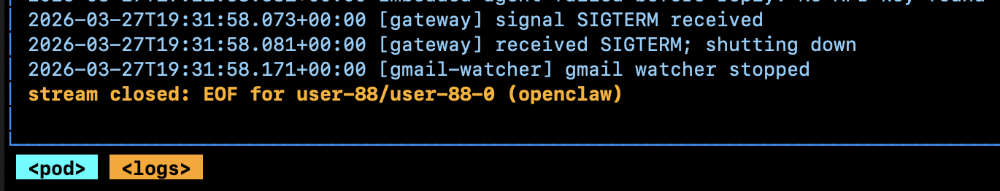

# Kubernetes Infrastructure POC for Multi-Tenant AI Trading Agents

## Learning Exercise

This POC explores Kubernetes patterns for managing AI trading agents **if a platform chooses to move from user-deployed infrastructure (like Railway templates in user accounts) to self-managed agent orchestration**.

This is purely a technical exploration, not a critique of any existing approach. Current deployment strategies (like Railway templates deployed in user accounts) solve different problems and have valid trade-offs.

### Architectural Challenges This Explores

When transitioning from user-managed deployments to platform-managed agent infrastructure, several patterns become relevant:

1. **Graceful shutdown during updates** — How to handle pod evictions when agents have active financial positions
2. **User credential isolation** — Exploring zero-knowledge patterns where the platform never sees plaintext API keys
3. **True multi-tenancy** — Namespace-level isolation per user with resource guarantees
4. **Declarative infrastructure** — Using Crossplane to provision entire agent stacks from a single CRD

**Context:** This was built as a learning exercise after exploring Kubernetes orchestration patterns for financial systems. Not a solution to anyone's problems—just an exploration of infrastructure patterns.

---

## Architecture Overview



### Key Components

### 1. Crossplane Composition Layer (Declarative Infrastructure)
One API call creates everything—exploring GitOps patterns for agent provisioning:

```yaml
apiVersion: platform.senpi.ai/v1alpha1
kind:
metadata:
  name: user-88-agent
  namespace: default
spec:
  parameters:
    userId: "user-88"
    walletAddress: "0xc97ff0A66bC84FB8BcCEa34065af48d86be72B45"
    modelProvider: "openai"
    modelApiKey: "Xktb3BlbmFpLWtleQo="
    modelApiKeySalt: "dGVzdHNhbHQxMjM0NTY3OA=="
    modelName: "gpt-4"
    strategy: "striker"
```

**What Crossplane provisions in this POC:**
- Dedicated namespace per user
- ServiceAccount with RBAC
- Secrets integration (AWS Secrets Manager → External Secrets Operator)
- StatefulSet with persistent volume
- Terminator sidecar for position protection

**Reconciliation:** Change the spec, Crossplane updates infrastructure. Delete the resource, everything gets cleaned up. No manual kubectl commands.

This POC shows 4 core resources. A production implementation would expand to include: NetworkPolicies, PodDisruptionBudgets, HorizontalPodAutoscaler, monitoring ServiceMonitors, backup CronJobs, etc.

**POC Evidence:**


*Single SenpiAgent resource triggers full stack provisioning*


*Crossplane composition provisions namespace, secrets, StatefulSet in sync*


*All child resources: namespace, ServiceAccount, secrets, StatefulSet running*


*OpenClaw agent deployed (with test credentials for POC)*


*Agent logs showing deployment*

**Note:** Deployment complexity is abstracted behind the CRD. Changes require only updating the resource spec.

### 2. Terminator Sidecar — Graceful Shutdown Pattern
Exploring how to handle pod evictions when agents have active positions:

When a pod receives SIGTERM (during updates, node drains, etc.), the PreStop hook can block termination until positions are safe. This prevents infrastructure events from abandoning open trades.


*PreStop hook catching SIGTERM*

Kubernetes PreStop hook with 5-minute timeout to prevent node deadlock:

```32:38:src/terminator/main.go
func checkActivePositions() bool {
	// MOCK LOGIC: In production, this would query the local agent state file
	// or the Hyperliquid API: /info -> "userOpenPositions"
	// For PoC: Check if a dummy file exists
	_, err := os.Stat("/tmp/active_trade.lock")
	return !os.IsNotExist(err)
}
```

[Full implementation →](src/terminator/main.go)

### 3. Zero-Knowledge Secrets Pattern
Exploring client-side encryption patterns where the platform never sees plaintext API keys:

**Pattern:** Client-side encryption → AWS Secrets Manager → External Secrets Operator → pod injection.

Users encrypt keys locally before upload. Platform manages encrypted blobs. Keys are decrypted only inside the agent pod. Audit trail included.

---

## Patterns Explored

This POC demonstrates several Kubernetes patterns relevant to multi-tenant agent orchestration:

| Pattern | Implementation | Value |
|---------|---------------|-------|
| **Graceful shutdown** | PreStop hooks with position checks | Prevents orphaned trades during updates |
| **Secret isolation** | Client-side encryption + ESO | Zero-knowledge credential management |
| **Declarative infrastructure** | Crossplane compositions | Single CRD provisions full stack |
| **Multi-tenancy** | Namespace-per-user + RBAC | True isolation between agents |

---

## Technical Stack Used

**Infrastructure:** EKS, Crossplane, Karpenter, VPC/IAM  
**Secrets:** AWS Secrets Manager, External Secrets Operator  
**Deployments:** StatefulSets, Helm charts  
**Observability:** Prometheus, Grafana, Loki  
**Agent Runtime:** OpenClaw integration (test deployment)  
**Blockchain:** Hyperliquid API integration patterns  

---

## What I Learned

Building this POC taught me:

1. **Crossplane's composition model** — How to create higher-level abstractions over Kubernetes primitives
2. **Pod lifecycle management** — PreStop hooks, graceful shutdown patterns, and SIGTERM handling
3. **Secrets management at scale** — External Secrets Operator integration with AWS Secrets Manager
4. **Multi-tenancy patterns** — Namespace isolation, RBAC, and resource quotas
5. **Financial system constraints** — Why standard Kubernetes patterns need modification for trading systems

---

## Limitations & Future Exploration

**Current POC limitations:**
- Mock position checking (production would query real Hyperliquid API)
- Test credentials only
- Single-cluster setup (no multi-region or HA)
- Basic observability (no alerting or SLOs)

**Future patterns to explore:**
- Circuit breakers for API failures
- State reconciliation after crashes
- Multi-region failover
- Cost optimization with Karpenter node pools
- Compliance automation (SOC 2, audit logs)

---

**Built as a learning exercise to explore Kubernetes patterns for financial systems.** Not a statement about any existing infrastructure—just curiosity about how these problems could be approached with self-managed orchestration.
